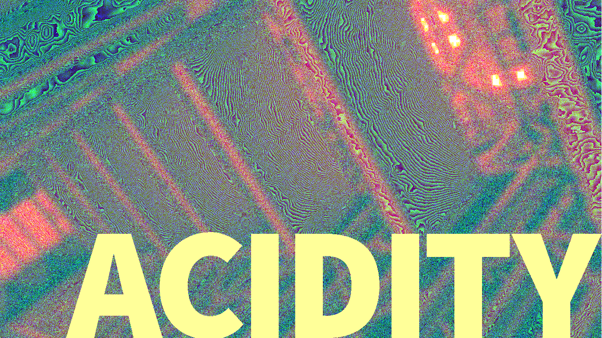

## About

[Ported from Crystal.](https://github.com/czycha/acidity) Unlike the original Crystal version, does not have a CLI and does not support transparency.

## Requirements

- [Processing v3](https://processing.org/download/)

## Options

Modify the following variables in acidity.pde:
- `RADIUS`: Used internally to produce this effect. Larger numbers take longer, but produce more interesting patterns.
- `IMAGENAME`: The name of the image to load, minus the extension. So the image "hennepin.png" has the name of "hennepin".
- `IMAGEEXT`: The extension of the image to load. The image "hennepin.png" has the extension "png".
- `SAVEME`: Set to `true` in order to save the image. Saves to "IMAGENAME.acid.IMAGEEXT" (for example, "hennepin.acid.png").

## Contributors

- [James Anthony Bruno](https://github.com/czycha/) - creator, maintainer